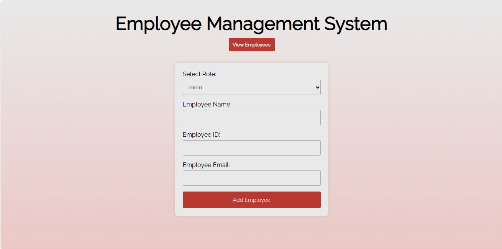

# Employee Management System
The Employee Management System is a simple web-based application that simplifies employee management. Built using HTML, JavaScript, and CSS, it allows users to add employee records and view all employee details. It leverages classes, switch statements, and try-catch-finally statements to perform all this actions and more.



## Table of Contents
- [Features](#features)
- [Prerequisites](#prerequisites)
- [Usage](#usage)
- [Screenshots](#screenshots)
- [Contributing](#contributing)
- [License](#license)

## Features
1. **Add Employee**: Users can add employees to the system by providing the employee's name and ID.
2. **View Employee**: Users can view employee details by entering the employee's ID. If the employee is found, their name and ID are displayed.

## Prerequisites
Before you begin, ensure you have met the following requirements:
- A modern web browser (e.g., Google Chrome, Mozilla Firefox).
- A text editor for viewing and editing the source code (e.g., Visual Studio Code, Sublime Text).

## Usage
1. Clone the repository to your local machine:
   ```bash
   git clone https://github.com/ozo-vehe/employee-management-system.git
   ```

2. Open the `index.html` file in your preferred web browser.

3. Use the Employee Management System as follows:
   - **Add Employee**: Select the employees role, enter the employee's name, email, and ID. Depending on the role selected, an additional input field will be displayed. For the intern role, enter the school, for engineer role, enter the GitHub profile url, and for the manager role, enter the employee's office number. Click on the `Add Employee` button to add the employee to the list.
   - **View Employee**: Click on the `View Employees` button to view all the saved employees arranged in a tabular form with each employee's details.

4. Enjoy using the Employee Management System!

## Contributing
Contributions are welcome! If you'd like to contribute to this project, please follow these steps:

1. Fork the project on GitHub.
2. Clone your forked repository to your local machine.
3. Create a new branch with a descriptive name: `git checkout -b feature/your-feature-name`.
4. Make your changes and commit them: `git commit -m 'Add some feature'`.
5. Push your changes to your forked repository: `git push origin feature/your-feature-name`.
6. Open a pull request on the original repository.
